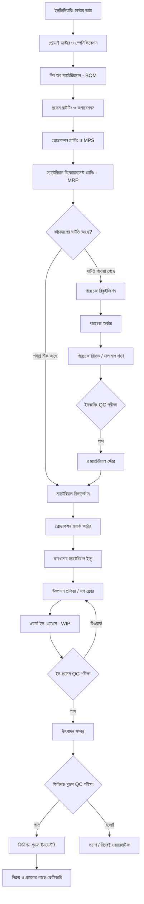
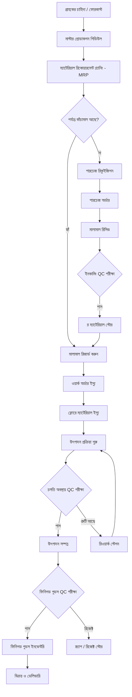
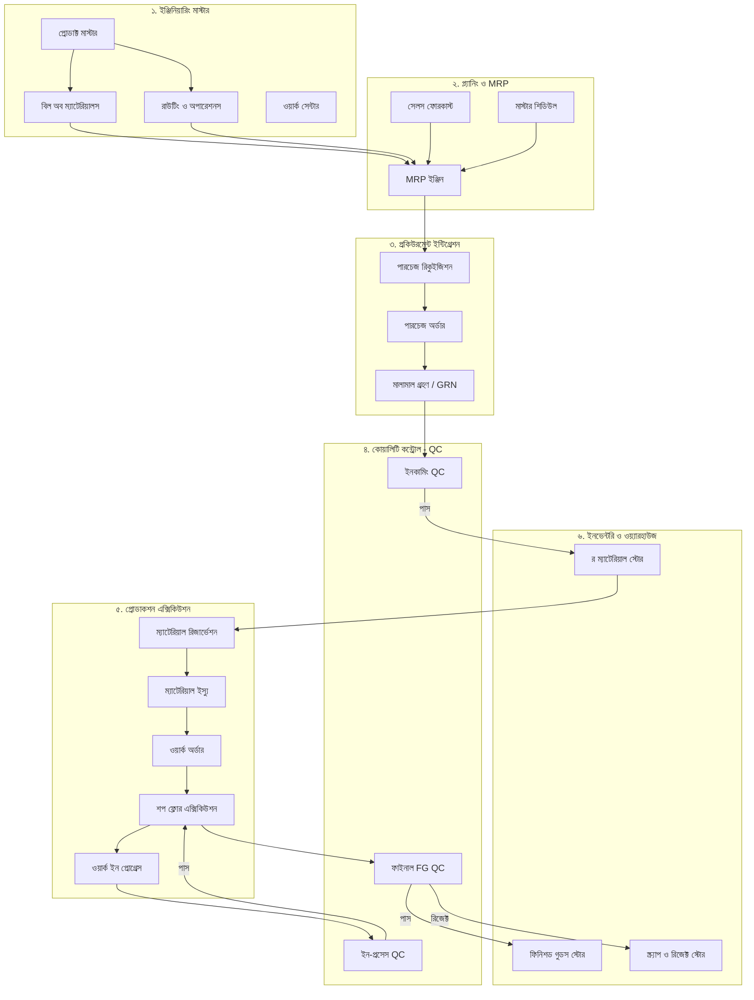

# ISO সার্টিফিকেটপ্রাপ্ত ম্যানুফ্যাকচারিং ERP আর্কিটেকচার ও ইমপ্লিমেন্টেশন গাইড

> আইএসও (ISO) স্ট্যান্ডার্ড অনুযায়ী এন্টারপ্রাইজ-গ্রেড ম্যানুফ্যাকচারিং ERP সিস্টেম তৈরির একটি পূর্ণাঙ্গ ও প্রফেশনাল ব্লুপ্রিন্ট।

---

## 📌 সূচিপত্র (Table of Contents)

- [১. আর্কিটেকচার ওভারভিউ (Mermaid ডায়াগ্রাম)](#১-আর্কিটেকচার-ওভারভিউ-mermaid-ডায়াগ্রাম)
- [২. ফেজ-বাই-ফেজ ইমপ্লিমেন্টেশন রোডম্যাপ](#২-ফেজ-বাই-ফেজ-ইমপ্লিমেন্টেশন-রোডম্যাপ)
- [৩. স্ট্যান্ডার্ড ম্যানুফ্যাকচারিং মডিউল স্ট্রাকচার](#৩-স্ট্যান্ডার্ড-ম্যানুফ্যাকচারিং-মডিউল-স্ট্রাকচার)
- [৪. সম্পূর্ণ ম্যানুফ্যাকচারিং ওয়ার্কফ্লো](#৪-সম্পূর্ণ-ম্যানুফ্যাকচারিং-ওয়ার্কফ্লো)
- [৫. বিল অব ম্যাটেরিয়ালস (BOM) স্ট্রাকচার](#৫-বিল-অব-ম্যাটেরিয়ালস-bom-স্ট্রাকচার)
- [৬. ম্যাটেরিয়াল রিকোয়ারমেন্ট প্ল্যানিং (MRP Engine)](#৬-ম্যাটেরিয়াল-রিকোয়ারমেন্ট-প্ল্যানিং-mrp-engine)
- [৭. পারচেজ রিকুইজিশন ও প্রকিউরমেন্ট (Procurement)](#৭-পারচেজ-রিকুইজিশন-ও-প্রকিউরমেন্ট-procurement)
- [৮. ইনভেন্টরি মুভমেন্ট ও ওয়্যারহাউজ ম্যাট্রিক্স](#৮-ইনভেন্টরি-মুভমেন্ট-ও-ওয়্যারহাউজ-ম্যাট্রিক্স)
- [৯. ওয়ার্ক অর্ডার ও শপ ফ্লোর কন্ট্রোল (Shop Floor Execution)](#৯-ওয়ার্ক-অর্ডার-ও-শপ-ফ্লোর-কন্ট্রোল-shop-floor-execution)
- [১০. ৩-স্টেজ কোয়ালিটি কন্ট্রোল (Quality Control - QC)](#১০-৩-স্টেজ-কোয়ালিটি-কন্ট্রোল-quality-control---qc)
- [১১. ব্যাচ ম্যানেজমেন্ট ও ট্রেসেবিলিটি (Traceability)](#১১-ব্যাচ-ম্যানেজমেন্ট-ও-ট্রেসেবিলিটি-traceability)
- [১২. ম্যানুফ্যাকচারিং কস্টিং ইঞ্জিন (Costing Engine)](#১২-ম্যানুফ্যাকচারিং-কস্টিং-ইঞ্জিন-costing-engine)
- [১৩. সম্পূর্ণ মডিউল রিলেশনশিপ আর্কিটেকচার](#১৩-সম্পূর্ণ-মডিউল-রিলেশনশিপ-আর্কিটেকচার)
- [১৪. আইএসও (ISO) এন্টারপ্রাইজ বেস্ট প্র্যাকটিস](#১৪-আইএসও-iso-এন্টারপ্রাইজ-বেস্ট-প্র্যাকটিস)

---

## ১. আর্কিটেকচার ওভারভিউ (Mermaid ডায়াগ্রাম)

---

## ২. ফেজ-বাই-ফেজ ইমপ্লিমেন্টেশন রোডম্যাপ

ডেভেলপমেন্ট টিম যাতে ধাপে ধাপে এবং কোনো রকম বিভ্রান্তি ছাড়াই সফটওয়্যারটি তৈরি করতে পারে, তার জন্য পুরো আর্কিটেকচারকে ৪টি ফেজে ভাগ করা হয়েছে:

| ফেজ (Phase) | মডিউলের পরিধি (Scope) | মূল ডেলিভারেবলসমূহ (Deliverables) | বিস্তারিত গাইড ডকুমেন্ট |
| :--- | :--- | :--- | :--- |
| **Phase 1** | **মাস্টার ডাটা ও ইনভেন্টরি** | প্রোডাক্ট মাস্টার, BOM ভার্সনিং, রাউটিং, ওয়ার্ক সেন্টার, RM ও FG স্টোর | 📘 [Module 01 গাইডলাইন](./docs/01-master-data-inventory.md) |
| **Phase 2** | **প্রোডাকশন এক্সিকিউশন** | ওয়ার্ক অর্ডার লাইফসাইকেল, ম্যাটেরিয়াল রিজার্ভেশন, ইস্যু, WIP ও EBR | 📗 [Module 02 গাইডলাইন](./docs/02-production-execution.md) |
| **Phase 3** | **MRP ও প্রকিউরমেন্ট** | সেলস ফোরকাস্ট, MPS, MRP ক্যালকুলেশন ইঞ্জিন, পারচেজ রিকুইজিশন | 📙 [Module 03 গাইডলাইন](./docs/03-mrp-procurement.md) |
| **Phase 4** | **QC, কস্টিং ও ISO অডিট** | ৩-স্টেজ QC, ইউনিট কস্টিং ইঞ্জিন, ট্র্যাকিং/ট্রেসেবিলিটি ও অডিট লগ | 📕 [Module 04 গাইডলাইন](./docs/04-qc-costing-iso.md) |

---

## ৩. স্ট্যান্ডার্ড ম্যানুফ্যাকচারিং মডিউল স্ট্রাকচার

একটি এন্টারপ্রাইজ ম্যানুফ্যাকচারিং ERP-তে প্রধানত নিচের ৯টি সাব-সিস্টেম বা মডিউল থাকে:

### A. ইঞ্জিনিয়ারিং মাস্টার (Engineering Master) — [বিস্তারিত গাইড ➔](./docs/01-master-data-inventory.md)
* প্রোডাক্ট মাস্টার ও টেকনিক্যাল স্পেসিফিকেশন
* প্রোডাক্ট ভার্সন ও ইসিএন/ইসিও (ECN/ECO Revision)
* রেসিপি / ফর্মুলা ম্যানেজমেন্ট
* বিল অব ম্যাটেরিয়ালস (BOM)
* প্রসেস রাউটিং ও অপারেশনের ক্রম
* ওয়ার্ক সেন্টার ও মেশিন মাস্টার
* টুলস ও ইকুইপমেন্ট মাস্টার

### B. প্ল্যানিং লেয়ার (Planning) — [বিস্তারিত গাইড ➔](./docs/03-mrp-procurement.md)
* ডিম্যান্ড প্ল্যানিং ও সেলস ফোরকাস্ট (Sales Forecast)
* মাস্টার প্রোডাকশন শিডিউল (MPS)
* প্রোডাকশন ক্যাপাসিটি প্ল্যানিং (CRP)
* ম্যাটেরিয়াল রিকোয়ারমেন্ট প্ল্যানিং (MRP Engine)

### C. প্রকিউরমেন্ট ইন্টিগ্রেশন (Procurement Integration) — [বিস্তারিত গাইড ➔](./docs/03-mrp-procurement.md)
* অটোমেটিক পারচেজ রিকুইজিশন (MRP ও Min-Stock থেকে)
* পারচেজ রিকুইজিশন অ্যাপ্রুভাল ওয়ার্কফ্লো
* পারচেজ অর্ডার (PO) ও গুডস রিসিভ (GRN)

### D. প্রোডাকশন এক্সিকিউশন (Production Execution) — [বিস্তারিত গাইড ➔](./docs/02-production-execution.md)
* ওয়ার্ক অর্ডার তৈরি ও স্ট্যাটাস লাইফসাইকেল
* ব্যাচ প্রোডাকশন ও মেশিন অ্যালোকেশন
* ম্যাটেরিয়াল রিজার্ভেশন ও ম্যাটেরিয়াল ইস্যু
* অপারেটর ও লেবার শিফট অ্যালোকেশন
* শপ ফ্লোর এন্ট্রি ও ব্যাচ সম্পন্নকরণ

### E. ইনভেন্টরি মুভমেন্ট ও ওয়্যারহাউজ (Inventory) — [বিস্তারিত গাইড ➔](./docs/01-master-data-inventory.md)
* কাঁচামাল বা র ম্যাটেরিয়াল স্টোর (RM Store)
* রিজার্ভড স্টক ট্র্যাকিং (Reserved Stock)
* প্রোডাকশন ইস্যু ও ওয়ার্ক-ইন-প্রোগ্রেস (WIP)
* ফিনিশড গুডস স্টোর (FG Store)
* রিজেক্ট, স্ক্র্যাপ ও রিওয়ার্ক ওয়্যারহাউজ

### F. কোয়ালিটি ম্যানেজমেন্ট (Quality Management) — [বিস্তারিত গাইড ➔](./docs/04-qc-costing-iso.md)
* ইনকামিং মালামাল কোয়ালিটি চেক (Incoming QC)
* প্রসেস চলাকালীন কোয়ালিটি চেক (In-Process QC)
* ফাইনাল প্রোডাক্ট কোয়ালিটি চেক (Final FG QC)
* ল্যাবরেটরি টেস্ট ও সার্টিফাইড রিপোর্ট (CoA Logging)

### G. ম্যানুফ্যাকচারিং কস্টিং (Costing Engine) — [বিস্তারিত গাইড ➔](./docs/04-qc-costing-iso.md)
* স্ট্যান্ডার্ড কস্ট বনাম একচুয়াল কস্ট বিশ্লেষণ
* ব্যাচ কস্টিং হিসাব (Batch Costing)
* ডাইরেক্ট লেবার ও মেশিন অবচয় খরচ
* ফ্যাক্টরি ওভারহেড ও বিদ্যুৎ বিল বণ্টন
* অপচয় বা স্ক্র্যাপ কস্ট হিসাব

### H. ট্রেসেবিলিটি ও ব্যাচ ট্র্যাকিং (Traceability) — [বিস্তারিত গাইড ➔](./docs/04-qc-costing-iso.md)
* ইউনিক ব্যাচ ও লট নম্বর জেনারেটর (Lot ID)
* সিরিয়াল নম্বর ট্র্যাকিং
* উৎপাদন ও মেয়াদোত্তীর্ণের তারিখ (Mfg & Expiry Date)
* রিকল ম্যানেজমেন্ট (Product Recall Workflow)

### I. রিপোর্টস ও অ্যানালিটিক্স (Reports & Analytics)
* প্রোডাকশন আউটপুট ও কর্মদক্ষতা রিপোর্ট
* মেশিন ইউটিলাইজেশন ও OEE (Overall Equipment Effectiveness)
* ম্যাটেরিয়াল ইল্ড ও ভ্যারিয়েন্স অ্যানালাইসিস (Yield Analysis)
* ব্যাচ হিস্ট্রি ও কস্ট অ্যানালাইসিস রিপোর্ট

---

## ৪. সম্পূর্ণ ম্যানুফ্যাকচারিং ওয়ার্কফ্লো

---

## ৫. বিল অব ম্যাটেরিয়ালস (BOM) স্ট্রাকচার

BOM হলো একটি প্রোডাক্ট তৈরির স্ট্যান্ডার্ড রেসিপি এবং উপকরণের তালিকা। (বিস্তারিত: [Module 01 Spec Guide](./docs/01-master-data-inventory.md))

### বাস্তব উদাহরণ (বিস্কুট ম্যানুফ্যাকচারিং):
* **ফিনিশড প্রোডাক্ট (FG):** বাটার বিস্কুট ২০০ গ্রাম
* **স্ট্যান্ডার্ড ব্যাচ সাইজ:** ১,০০০ প্যাকেট
* **প্রত্যাশিত উৎপাদিকা (Standard Yield):** ৯৮০ প্যাকেট (২% সম্ভাব্য অপচয়)
* **কাঁচামাল (Raw Ingredients):** ময়দা, চিনি, লবণ, গুঁড়ো দুধ, মাখন, তেল, বেকিং পাউডার, ফ্লেভার
* **প্যাকিং উপাদান (Packaging Material):** প্রিন্টেড প্যাকেট, ইনার র‍্যাপার, কার্টন, লেবেল, টেপ

---

## ৬. ম্যাটেরিয়াল রিকোয়ারমেন্ট প্ল্যানিং (MRP Engine)

ম্যাটেরিয়াল রিকোয়ারমেন্ট প্ল্যানিং ইনভেন্টরি ঘাটতি নির্ধারণ করে। (বিস্তারিত: [Module 03 Spec Guide](./docs/03-mrp-procurement.md))

* **ময়দার স্টক হিসাব:** বর্তমান স্টক = ২০০ কেজি | প্রয়োজন = ২৫০ কেজি | **ঘাটতি = ৫০ কেজি** -> *অটোমেটিক পারচেজ রিকুইজিশন (PR) তৈরি হবে*

---

## ৭. পারচেজ রিকুইজিশন ও প্রকিউরমেন্ট

পারচেজ রিকুইজিশন (PR) ৩টি উপায়ে ট্রিগার হয়: (১) অটোমেটিক MRP থেকে, (২) ম্যানুয়াল এন্ট্রি, (৩) সেফটি স্টক লেভেল (ROP) থেকে। (বিস্তারিত: [Module 03 Spec Guide](./docs/03-mrp-procurement.md))

---

## ৮. ইনভেন্টরি মুভমেন্ট ও ওয়্যারহাউজ ম্যাট্রিক্স

(বিস্তারিত: [Module 01 Spec Guide](./docs/01-master-data-inventory.md))

| ইভেন্ট / পর্যায় | র ম্যাটেরিয়াল স্টক | রিজার্ভড স্টক | WIP (চলতি স্টক) | ফিনিশড গুডস স্টক | রিজেক্ট / স্ক্র্যাপ স্টক |
| :--- | :--- | :--- | :--- | :--- | :--- |
| **মালামাল গ্রহণ ও QC পাস** | `+ ইনবাউন্ড` | অপরিবর্তিত | অপরিবর্তিত | অপরিবর্তিত | অপরিবর্তিত |
| **মালামাল রিজার্ভেশন** | `Available -` | `Reserved +` | অপরিবর্তিত | অপরিবর্তিত | অপরিবর্তিত |
| **ফ্লোরে ম্যাটেরিয়াল ইস্যু** | `Total -` | `Reserved -` | `WIP +` | অপরিবর্তিত | অপরিবর্তিত |
| **উৎপাদন সম্পন্ন** | অপরিবর্তিত | অপরিবর্তিত | `WIP -` | অপরিবর্তিত | অপরিবর্তিত |
| **ফাইনাল QC পাস** | অপরিবর্তিত | অপরিবর্তিত | অপরিবর্তিত | `+ FG Store` | অপরিবর্তিত |
| **ফাইনাল QC রিজেক্ট** | অপরিবর্তিত | অপরিবর্তিত | অপরিবর্তিত | অপরিবর্তিত | `+ Reject/Scrap` |

---

## ৯. ওয়ার্ক অর্ডার ও শপ ফ্লোর কন্ট্রোল (Shop Floor Execution)

(বিস্তারিত: [Module 02 Spec Guide](./docs/02-production-execution.md))

### লাইফসাইকেল স্ট্যাটাস ফ্লো (State Machine):
$$\text{Draft} \longrightarrow \text{Planned} \longrightarrow \text{Released} \longrightarrow \text{In Progress} \longrightarrow \text{QC Inspection} \longrightarrow \text{Completed} \longrightarrow \text{Closed}$$

---

## ১০. ৩-স্টেজ কোয়ালিটি কন্ট্রোল (Quality Control - QC)

(বিস্তারিত: [Module 04 Spec Guide](./docs/04-qc-costing-iso.md))

1. **ইনকামিং QC (Incoming QC):** র ম্যাটেরিয়াল স্টোরে জমা হওয়ার আগে পরীক্ষা।
2. **ইন-প্রসেস QC (In-Process QC):** মেশিন চলাকালীন নিয়মিত পরীক্ষা।
3. **ফাইনাল QC (Final Goods QC):** ফিনিশড গুডস স্টোরে পাঠানোর আগে চূড়ান্ত ল্যাব টেস্ট।

---

## ১১. ব্যাচ ম্যানেজমেন্ট ও ট্রেসেবিলিটি (Traceability)

(বিস্তারিত: [Module 04 Spec Guide](./docs/04-qc-costing-iso.md))

---

## ১২. ম্যানুফ্যাকচারিং কস্টিং ইঞ্জিন (Costing Engine)

(বিস্তারিত: [Module 04 Spec Guide](./docs/04-qc-costing-iso.md))

$$\text{মোট উৎপাদন খরচ} = \text{কাঁচামাল খরচ} + \text{প্যাকিং খরচ} + \text{ডাইরেক্ট লেবার} + \text{মেশিন খরচ} + \text{বিদ্যুৎ বিল} + \text{ওভারহেড} + \text{QC খরচ} + \text{অপচয় কস্ট}$$

$$\text{ইউনিট কস্ট} = \frac{\text{মোট উৎপাদন খরচ}}{\text{উৎপাদিত ভালো পণ্যের পরিমাণ (Actual Good Quantity)}}$$

---

## ১৩. সম্পূর্ণ মডিউল রিলেশনশিপ আর্কিটেকচার

---

## ১৪. আইএসও (ISO) এন্টারপ্রাইজ বেস্ট প্র্যাকটিস

(বিস্তারিত: [Module 04 Spec Guide](./docs/04-qc-costing-iso.md))

1. **ইঞ্জিনিয়ারিং চেঞ্জ কন্ট্রোল (ECN/ECO):** BOM বা রেসিপি পরিবর্তনের জন্য প্রাতিষ্ঠানিক অনুমোদিত প্রসেস।
2. **BOM ভার্সনিং:** একই প্রোডাক্টের একাধিক active/inactive ভার্সন রাখার সুবিধা।
3. **কঠোর ডকুমেন্ট স্ট্যাটাস ফ্লো:** Draft → Planned → Released → In Progress → Completed → Closed।
4. **ম্যাটেরিয়াল রিজার্ভেশন:** ওয়ার্ক অর্ডার রিলিজের আগে কাঁচামাল রিজার্ভ করে স্টক দ্বন্দ্ব এড়ানো।
5. **ব্যাকফ্লাশ ও একচুয়াল কনসাম্পশন:** Standard/Actual Consumption Support।
6. **ইল্ড ও ভ্যারিয়েন্স অ্যানালাইসিস:** Standard Yield বনাম Actual Yield।
7. **মেশিন ও ক্যাপাসিটি প্ল্যানিং:** Capacity, Shift এবং Machine Load Balancing।
8. **ইলেকট্রনিক ব্যাচ রেকর্ড (EBR):** প্রতিটি ব্যাচের ডিজিটাল হিস্ট্রি সংরক্ষণ।
9. **এন্ড-টু-এন্ড ট্রেসেবিলিটি:** Raw Material Lot → Production Batch → FG Batch → Customer।
10. **সিস্টেম অডিট ট্রেইল (Audit Trail):** কে, কখন, কী পরিবর্তন করেছে তার সম্পূর্ণ ইতিহাস।
