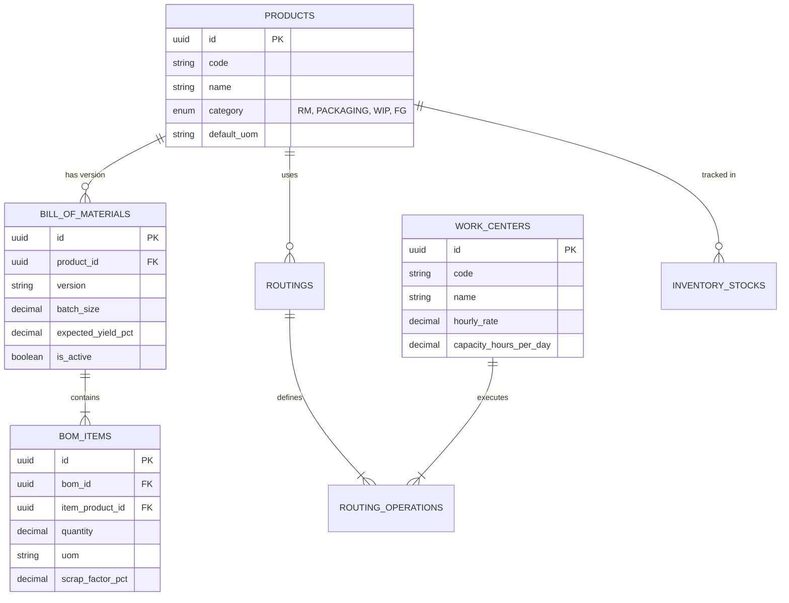

# মডিউল ০১: মাস্টার ডাটা ও ইনভেন্টরি ম্যানেজমেন্ট

> **আর্কিটেকচার নেভিগেশন:** [🏠 মূল আর্কিটেকচার গাইড (README.md)](../README.md) | [পরবর্তী মডিউল: প্রোডাকশন এক্সিকিউশন (Module 02) ➔](./02-production-execution.md)

---

## ১. ইঞ্জিনিয়ারিং মাস্টার ডাটা (Engineering Master)

ইঞ্জিনিয়ারিং মাস্টার লেয়ারে পণ্য তৈরি, রেসিপি গঠন এবং শপ ফ্লোর রিসোর্সের সকল মৌলিক প্যারামিটার সংজ্ঞায়িত করা হয়।

### মূল উপাদানসমূহ:

1. **প্রোডাক্ট মাস্টার ও টেকনিক্যাল স্পেসিফিকেশন**
   - স্ট্যান্ডার্ড প্রোডাক্ট ডেফিনিশন (ফিনিশড গুডস, সেমি-ফিনিশড গুডস, র ম্যাটেরিয়ালস, প্যাকিং উপাদান)।
   - পণ্য বৈশিষ্ট্যের বিবরণ (দৈর্ঘ্য-প্রস্থ, ওজনের সহনশীলতা, আর্দ্রতা লেভেল, কেমিক্যাল কম্পোজিশন)।
2. **প্রোডাক্ট ভার্সন ও রিভিশন কন্ট্রোল**
   - ইঞ্জিনিয়ারিং চেঞ্জ নোটিশ (ECN) এবং ইঞ্জিনিয়ারিং চেঞ্জ অর্ডার (ECO) অনুমোদন প্রক্রিয়া।
   - ভার্সনের কার্যকর শুরু এবং শেষ তারিখ (Effective Dates)।
3. **বিল অব ম্যাটেরিয়ালস (BOM) ও রেসিপি**
   - মাল্টি-লেভেল BOM হায়ারার্কি (প্যারেন্ট-চাইল্ড সম্পর্ক)।
   - স্ট্যান্ডার্ড ব্যাচ সাইজ এবং প্রত্যাশিত ইল্ড %।
   - উপজাত দ্রব্য (By-product & Co-product) বন্টন।
   - স্বাভাবিক অপচয় বা স্ক্র্যাপ শতকরা হার।
4. **প্রসেস রাউটিং ও ওয়ার্ক সেন্টার**
   - কাজের ক্রমানুসারে অপারেশন ম্যাপিং (কাটিং -> অ্যাসেম্বলি -> ফিনিশিং -> প্যাকিং)।
   - প্রতি ইউনিটের জন্য স্ট্যান্ডার্ড লেবার ও মেশিন সেটআপ/রান টাইম।
   - ওয়ার্ক সেন্টারের দৈনিক ক্যাপাসিটি, কার্যক্ষমতা এবং শিফট সময়সূচি।
5. **টুলস ও মেশিন মাস্টার**
   - মেশিন আইডি, রক্ষনাবেক্ষন শিডিউল এবং টুলের সামঞ্জস্যতা।

---

## ২. ইনভেন্টরি মুভমেন্ট ও ওয়্যারহাউজ

ফ্যাক্টরির কাঁচামাল, চলতি পণ্য (WIP) এবং ফিনিশড গুডসের প্রতিটি পর্যায়ভিত্তিক স্থানান্তর ট্র্যাক করে।

### ওয়্যারহাউজ পর্যায় ও স্টকের ধরন:
- **র ম্যাটেরিয়াল স্টোর (RM Store):** ক্রয়কৃত এবং ইনকামিং QC পাস করা কাঁচামাল।
- **রিজার্ভড স্টক (Reserved Stock):** অনুমোদিত ওয়ার্ক অর্ডারের জন্য নির্দিষ্ট করে রাখা কাঁচামাল।
- **ওয়ার্ক-ইন-প্রোগ্রেস (WIP):** কারখানার শপ ফ্লোরে বর্তমানে উৎপাদনাধীন কাঁচামাল।
- **ফিনিশড গুডস স্টোর (FG Store):** পরীক্ষা ও অনুমোদনপ্রাপ্ত চূড়ান্ত বিক্রয়যোগ্য পণ্য।
- **কোয়ারেন্টাইন / রিজেক্ট স্টোর:** ত্রুটিপূর্ণ উপাদান যা বিক্রেতার কাছে ফেরত বা স্ক্র্যাপ হিসেবে ফেলা হবে।
- **স্ক্র্যাপ / ওয়েস্ট স্টোর:** উৎপাদনের স্বাভাবিক সীমার বাইরে নষ্ট হওয়া কাঁচামাল।

### ইনভেন্টরি স্টক মুভমেন্ট ম্যাট্রিক্স:

| ইভেন্ট / পর্যায় | র ম্যাটেরিয়াল স্টক | রিজার্ভড স্টক | WIP (চলতি স্টক) | ফিনিশড গুডস স্টক | রিজেক্ট / স্ক্র্যাপ স্টক |
| :--- | :--- | :--- | :--- | :--- | :--- |
| **মালামাল গ্রহণ ও QC পাস** | `+ ইনবাউন্ড` | অপরিবর্তিত | অপরিবর্তিত | অপরিবর্তিত | অপরিবর্তিত |
| **ওয়ার্ক অর্ডার রিজার্ভেশন** | `Available -` | `Reserved +` | অপরিবর্তিত | অপরিবর্তিত | অপরিবর্তিত |
| **ফ্লোরে ম্যাটেরিয়াল ইস্যু** | `Total -` | `Reserved -` | `+ উৎপাদনাধীন` | অপরিবর্তিত | অপরিবর্তিত |
| **উৎপাদন সম্পন্নকরণ** | অপরিবর্তিত | অপরিবর্তিত | `- সম্পন্ন` | অপরিবর্তিত | অপরিবর্তিত |
| **ফাইনাল QC পাস** | অপরিবর্তিত | অপরিবর্তিত | অপরিবর্তিত | `+ FG Store` | অপরিবর্তিত |
| **ফাইনাল QC রিজেক্ট** | অপরিবর্তিত | অপরিবর্তিত | অপরিবর্তিত | অপরিবর্তিত | `+ Reject/Scrap` |

---

## ৩. ডাটাবেজ স্কিমা গাইডলাইন (Suggested ERD)

---

## 🔗 দ্রুত নেভিগেশন (Quick Navigation)

- 🏠 **মূল পেজ:** [ISO Certified Manufacturing ERP README](../README.md)
- ➔ **পরবর্তী মডিউল:** [মডিউল ০২: প্রোডাকশন এক্সিকিউশন (Module 02)](./02-production-execution.md)
