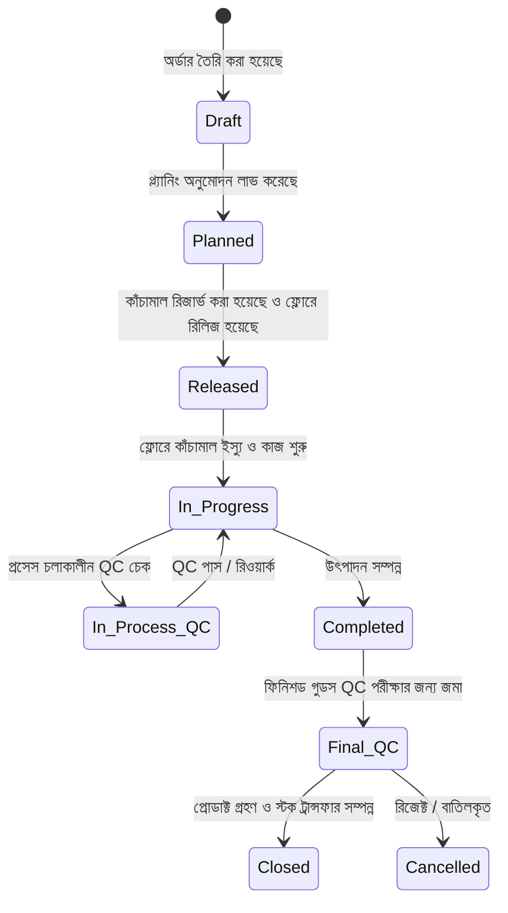
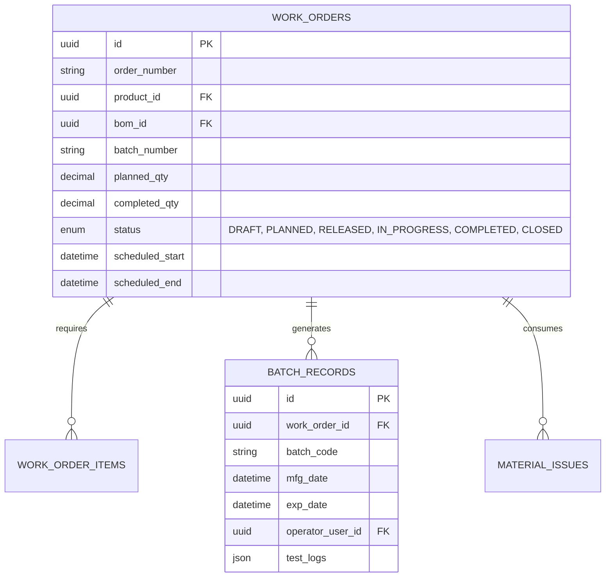

# মডিউল ০২: প্রোডাকশন এক্সিকিউশন ও শপ ফ্লোর কন্ট্রোল

> **আর্কিটেকচার নেভিগেশন:** [🏠 মূল আর্কিটেকচার গাইড (README.md)](../README.md) | [⬅️ পূর্ববর্তী: মডিউল ০১](./01-master-data-inventory.md) | [পরবর্তী: মডিউল ০৩ ➔](./03-mrp-procurement.md)

---

## ১. ওয়ার্ক অর্ডার ম্যানেজমেন্ট (Work Order)

ওয়ার্ক অর্ডার হলো ফ্যাক্টরি ফ্লোরে উৎপাদন শুরুর অনুমোদন ও দিকনির্দেশনামূলক অফিশিয়াল ডকুমেন্ট।

### ওয়ার্ক অর্ডারের মূল ডাটা ফিল্ডসমূহ:
* **ওয়ার্ক অর্ডার নম্বর:** ইউনিক কোড (যেমন: `WO-2026-00892`)
* **প্রোডাক্ট রেফারেন্স:** ফিনিশড গুডস বা সেমি-ফিনিশড আইটেম আইডি
* **BOM ভার্সন:** রেসিপির সুনির্দিষ্ট রিভিশন ভার্সন (যেমন: `v2.1`)
* **ব্যাচ / লট নম্বর:** নির্ধারিত ব্যাচ আইডি (যেমন: `BIS250701`)
* **লক্ষ্যমাত্রা (পরিমাণ):** নির্ধারিত মোট উৎপাদনের পরিমাণ
* **নির্ধারিত ওয়ার্ক সেন্টার ও মেশিন:** নির্দিষ্ট মেশিন ও স্টেশন বরাদ্দ
* **অপারেটর / লেবার টিম:** দায়িত্বপ্রাপ্ত শ্রমিক বা অপারেটর দল
* **উৎপাদন সময়সূচি:** সম্ভাব্য শুরুর তারিখ ও শেষ করার তারিখ
* **স্ট্যাটাস ট্র্যাকিং:** বর্তমান অবস্থা (State Tracking)
* **QC ইন্সপেকশন প্ল্যান:** বাধ্যতামূলক স্যাম্পলিং ও টেস্টের নিয়মাবলী

---

## ২. ওয়ার্ক অর্ডার লাইফসাইকেল স্ট্যাটাস ফ্লো (State Machine)

---

## ৩. শপ ফ্লোর এক্সিকিউশন ও ম্যাটেরিয়াল মুভমেন্ট

1. **ম্যাটেরিয়াল রিজার্ভেশন:** ওয়ার্ক অর্ডার `Released` স্ট্যাটাসে গেলে স্টক সফট-লক হয় যেন অন্য কোন অর্ডারে তা ব্যবহৃত না হয়।
2. **ম্যাটেরিয়াল ইস্যু:** কাঁচামাল ফ্লোরে শারীরিকভাবে পাঠানো হয় (`RM Store -` -> `WIP +`)।
3. **ব্যবহারের হিসাব পদ্ধতি (Consumption Methods):**
   - **ব্যাকফ্লাশিং (Backflushing):** কাজ শেষ হলে BOM-এর স্ট্যান্ডার্ড হার অনুযায়ী সিস্টেম থেকে স্বয়ংক্রিয়ভাবে স্টক বিয়োগ করা।
   - **একচুয়াল কনসাম্পশন (Actual Consumption):** স্ক্যান করে ব্যবহৃত উপকরণের ব্যাচ নম্বর সরাসরি ইনপুট দেওয়া (ISO/FDA অডিটের জন্য বাধ্যতামূলক)।
4. **ইলেকট্রনিক ব্যাচ রেকর্ড (EBR):** মেশিনের রান-টাইম, অপারেটর শিফট, তাপমাত্রা ও পরিবেশগত আর্দ্রতার ডিজিটাল লগ সংরক্ষণ।

---

## ৪. ডাটাবেজ স্কিমা গাইডলাইন (Suggested ERD)

---

## 🔗 দ্রুত নেভিগেশন (Quick Navigation)

- ⬅️ **পূর্ববর্তী মডিউল:** [মডিউল ০১: মাস্টার ডাটা ও ইনভেন্টরি](./01-master-data-inventory.md)
- 🏠 **মূল পেজ:** [ISO Certified Manufacturing ERP README](../README.md)
- ➔ **পরবর্তী মডিউল:** [মডিউল ০৩: MRP ও প্রকিউরমেন্ট](./03-mrp-procurement.md)
