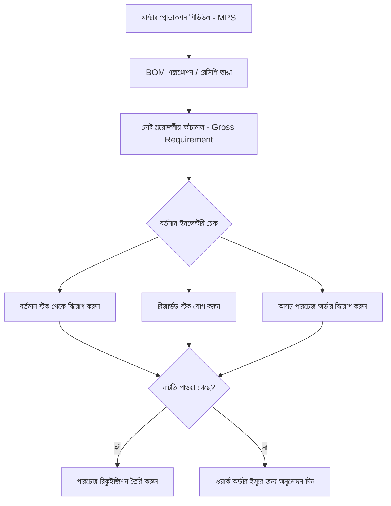
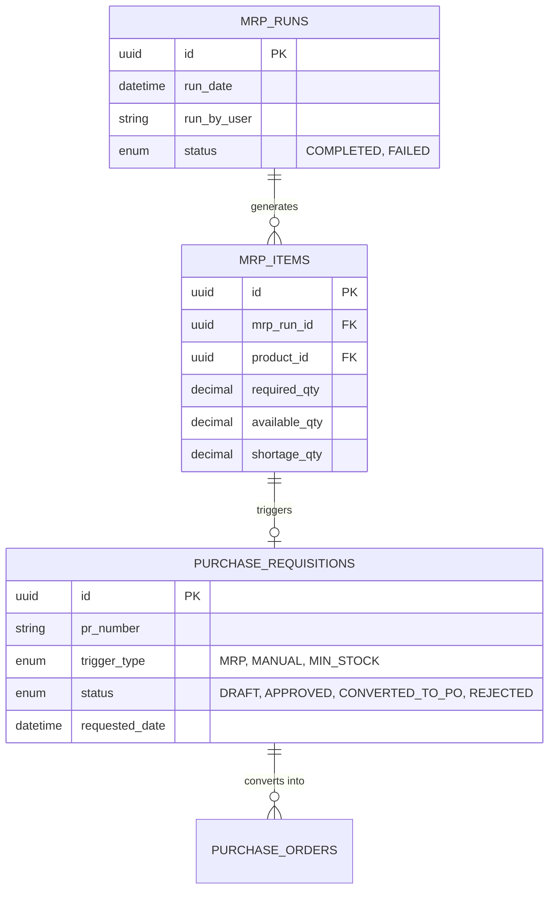

# মডিউল ০৩: MRP ও প্রকিউরমেন্ট ইন্টিগ্রেশন

> **আর্কিটেকচার নেভিগেশন:** [🏠 মূল আর্কিটেকচার গাইড (README.md)](../README.md) | [⬅️ পূর্ববর্তী: মডিউল ০২](./02-production-execution.md) | [পরবর্তী: মডিউল ০৪ ➔](./04-qc-costing-iso.md)

---

## ১. প্ল্যানিং লেয়ার হায়ারার্কি (Planning Levels)

1. **ডিম্যান্ড প্ল্যানিং ও সেলস ফোরকাস্ট:** গ্রাহকের অর্ডার ও বাজারের চাহিদার পূর্বাভাস সমন্বয় করে।
2. **মাস্টার প্রোডাকশন শিডিউল (MPS):** কোন ফিনিশড প্রোডাক্ট, কী পরিমাণে এবং কোন তারিখের মধ্যে তৈরি হবে তা নির্ধারণ করে।
3. **ক্যাপাসিটি রিকোয়ারমেন্ট প্ল্যানিং (CRP):** মেশিন ও লেবারের শিফট ক্যাপাসিটি যাচাই করে।
4. **ম্যাটেরিয়াল রিকোয়ারমেন্ট প্ল্যানিং (MRP Engine):** মোট প্রয়োজনীয় কাঁচামাল ও প্যাকিং উপাদান হিসাব করে ঘাটতি শনাক্ত করে।

---

## ২. MRP ইঞ্জিনের লজিক ও হিসাবের বাস্তব উদাহরণ

### হিসাবের লজিক ফ্লো:

### বিস্কুট ম্যানুফ্যাকচারিং হিসাবের উদাহরণ:

* **উৎপাদন লক্ষ্য:** `১,০০০ প্যাকেট` বাটার বিস্কুট (২০০ গ্রাম)
* **BOM অনুযায়ী প্রমিত উপাদান:**
  - ময়দা = ২৫০ গ্রাম / প্যাকেট -> মোট ২৫০ কেজি
  - চিনি = ৫০ গ্রাম / প্যাকেট -> মোট ৫০ কেজি
  - তেল = ২০ গ্রাম / প্যাকেট -> মোট ২০ কেজি
  - গুঁড়ো দুধ = ১০ গ্রাম / প্যাকেট -> মোট ১০ কেজি

#### MRP অডিট ফলাফল ও স্বয়ংক্রিয় সিদ্ধান্ত:
| উপাদান | মোট প্রয়োজন | বর্তমান স্টক | রিজার্ভড স্টক | উপলব্ধ স্টক | ঘাটতি | স্বয়ংক্রিয় ব্যবস্থা |
| :--- | :--- | :--- | :--- | :--- | :--- | :--- |
| **ময়দা** | ২৫০ কেজি | ২০০ কেজি | ০ কেজি | ২০০ কেজি | **৫০ কেজি** | **অটো পারচেজ রিকুইজিশন (৫০ কেজি)** |
| **চিনি** | ৫০ কেজি | ১০০ কেজি | ২০ কেজি | ৮০ কেজি | ০ কেজি | পর্যাপ্ত মালামাল আছে |
| **তেল** | ২০ কেজি | ৩০ কেজি | ৫ কেজি | ২৫ কেজি | ০ কেজি | পর্যাপ্ত মালামাল আছে |
| **গুঁড়ো দুধ** | ১০ কেজি | ৮ কেজি | ০ কেজি | ৮ কেজি | **২ কেজি** | **অটো পারচেজ রিকুইজিশন (২ কেজি)** |

---

## ৩. পারচেজ রিকুইজিশন ট্র্রিগার মেকানিজম

পারচেজ রিকুইজিশন (PR) তিনটি মাধ্যমে তৈরি হয়:
1. **অটোমেটিক ট্র্রিগার (MRP Engine):** কাঁচামালের ঘাটতি হিসাব করে সিস্টেম স্বয়ংক্রিয়ভাবে তৈরি করে।
2. **ম্যানুয়াল ট্র্রিগার:** ফ্যাক্টরি ম্যানেজারের সরাসরি এন্ট্রি।
3. **মিনিমাম স্টক রুল (Reorder Point - ROP):** স্টোরে কাঁচামাল সেফটি স্টকের নিচে নামলেই সিস্টেম পারচেজ রিকুইজিশন দেয়।

---

## ৪. ডাটাবেজ স্কিমা গাইডলাইন (Suggested ERD)

---

## 🔗 দ্রুত নেভিগেশন (Quick Navigation)

- ⬅️ **পূর্ববর্তী মডিউল:** [মডিউল ০২: প্রোডাকশন এক্সিকিউশন](./02-production-execution.md)
- 🏠 **মূল পেজ:** [ISO Certified Manufacturing ERP README](../README.md)
- ➔ **পরবর্তী মডিউল:** [মডিউল ০৪: QC, কস্টিং ও অডিট](./04-qc-costing-iso.md)
