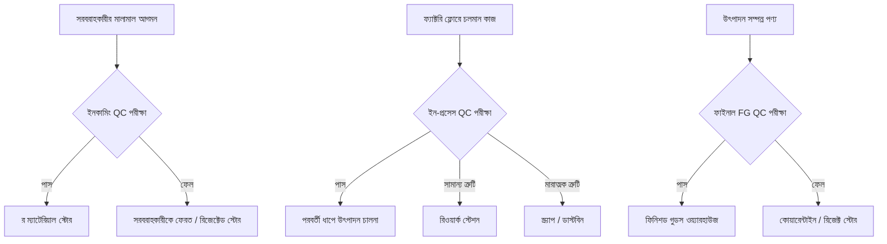
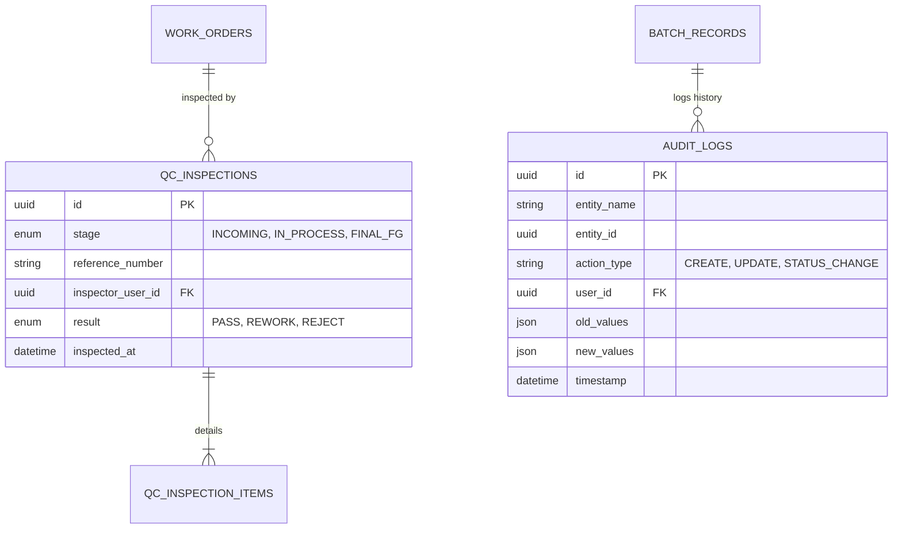

# মডিউল ০৪: কোয়ালিটি কন্ট্রোল, কস্টিং ও ISO অডিট ট্রেইল

> **আর্কিটেকচার নেভিগেশন:** [🏠 মূল আর্কিটেকচার গাইড (README.md)](../README.md) | [⬅️ পূর্ববর্তী: মডিউল ০৩](./03-mrp-procurement.md) | [হোম পেজ 🏠](../README.md)

---

## ১. ৩-স্টেজ কোয়ালিটি কন্ট্রোল (QC) আর্কিটেকচার

মান বজায় রাখার জন্য তিনটি বাধ্যতামূলক চেকপয়েন্টে পরীক্ষা সম্পন্ন হয়:

### ৩টি পর্যায়ের বিস্তারিত:
1. **ইনকামিং QC:** বিক্রেতার কাছ থেকে আসা কাঁচামালের কোয়ালিটি সনদ, বিশুদ্ধতা ও মেয়াদ যাচাইকরণ।
2. **ইন-প্রসেস QC:** মেশিন চলাকালীন প্রতি ঘণ্টায় ওজনের সমতা, তাপমাত্রা, আর্দ্রতা ও সাইজ লক করা।
3. **ফাইনাল FG QC:** ফিনিশড গুডস স্টোরে যাওয়ার আগে চূড়ান্ত র‍্যান্ডম ল্যাব টেস্ট।

---

## ২. ম্যানুফ্যাকচারিং কস্টিং ইঞ্জিন (Costing Engine)

### মোট উৎপাদন খরচ হিসাবের সূত্র:

$$\text{মোট উৎপাদন খরচ} = \text{কাঁচামাল খরচ} + \text{প্যাকিং খরচ} + \text{ডাইরেক্ট লেবার} + \text{মেশিন খরচ} + \text{বিদ্যুৎ বিল} + \text{মেইনটেন্যান্স} + \text{ওভারহেড} + \text{QC খরচ} + \text{অপচয় খরচ}$$

### একক পণ্যের খরচ হিসাবের সূত্র:

$$\text{ইউনিট কস্ট} = \frac{\text{মোট উৎপাদন খরচ}}{\text{উৎপাদিত ভালো পণ্যের পরিমাণ (Actual Good Yield Qty)}}$$

---

## ৩. এন্ড-টু-এন্ড ট্রেসেবিলিটি (Lot & Batch Tracking)

প্রতিটি উৎপাদিত ব্যাচ একটি ইউনিক আইডি পায় (যেমন: `BIS250701`)। সিস্টেম দ্বিমুখী ট্র্যাকিং বজায় রাখে:
* **সম্মুখ ট্র্যাকিং (Forward Traceability):** সরবরাহকারীর লট -> মালামাল গ্রহণ -> ওয়ার্ক অর্ডার ব্যাচ -> ফিনিশড গুডস ব্যাচ -> সেলস অর্ডার -> কাস্টমার ডেলিভারি।
* **পশ্চাৎ ট্র্যাকিং (Backward Traceability / Recall):** কাস্টমারের অভিযোগ -> ফিনিশড গুডস ব্যাচ -> অপারেটর ও মেশিন লগ -> ব্যবহৃত কাঁচামাল লট -> পারচেজ অর্ডার।

---

## ৪. আইএসও (ISO) কমপ্লায়েন্স বেস্ট প্র্যাকটিস চেকলিস্ট

* [x] **ইঞ্জিনিয়ারিং চেঞ্জ কন্ট্রোল (ECN/ECO):** BOM বা রেসিপি পরিবর্তনের জন্য প্রাতিষ্ঠানিক অনুমোদিত প্রসেস।
* [x] **BOM ভার্সনিং:** একই প্রোডাক্টের একাধিক active/inactive ভার্সন রাখার সুবিধা।
* [x] **কঠোর ডকুমেন্ট স্ট্যাটাস ফ্লো:** `Draft` → `Planned` → `Released` → `In Progress` → `Completed` → `Closed` অনুসরণ করা।
* [x] **ম্যাটেরিয়াল রিজার্ভেশন:** ওয়ার্ক অর্ডার রিলিজের আগে কাঁচামাল রিজার্ভ করে স্টক দ্বন্দ্ব এড়ানো।
* [x] **ব্যাকফ্লাশ ও একচুয়াল কনসাম্পশন:** স্ট্যান্ডার্ড কনসাম্পশন (Backflush) অথবা স্ক্যান করা একচুয়াল কনসাম্পশন সাপোর্ট।
* [x] **ইল্ড ও ভ্যারিয়েন্স অ্যানালাইসিস:** স্ট্যান্ডার্ড ইল্ড বনাম একচুয়াল ইল্ডের পার্থক্য হিসাব করা।
* [x] **মেশিন ও ক্যাপাসিটি প্ল্যানিং:** ওয়ার্ক সেন্টার অনুযায়ী মেশিন লোড ও শিফট ব্যালেন্স করা।
* [x] **ইলেকট্রনিক ব্যাচ রেকর্ড (EBR):** প্রতিটি ব্যাচের ডিজিটাল হিস্ট্রি সংরক্ষণ (ISO/FDA অডিটের জন্য আবশ্যক)।
* [x] **সিস্টেম অডিট ট্রেইল (Audit Trail):** কে, কখন, কী পরিবর্তন করেছে তার সম্পূর্ণ ইতিহাস রাখা (ISO অডিট সার্টিফিকেশনের জন্য বাধ্যতামূলক)।

---

## ৫. ডাটাবেজ স্কিমা গাইডলাইন (Suggested ERD)

---

## 🔗 দ্রুত নেভিগেশন (Quick Navigation)

- ⬅️ **পূর্ববর্তী মডিউল:** [মডিউল ০৩: MRP ও প্রকিউরমেন্ট](./03-mrp-procurement.md)
- 🏠 **মূল পেজ:** [ISO Certified Manufacturing ERP README](../README.md)
